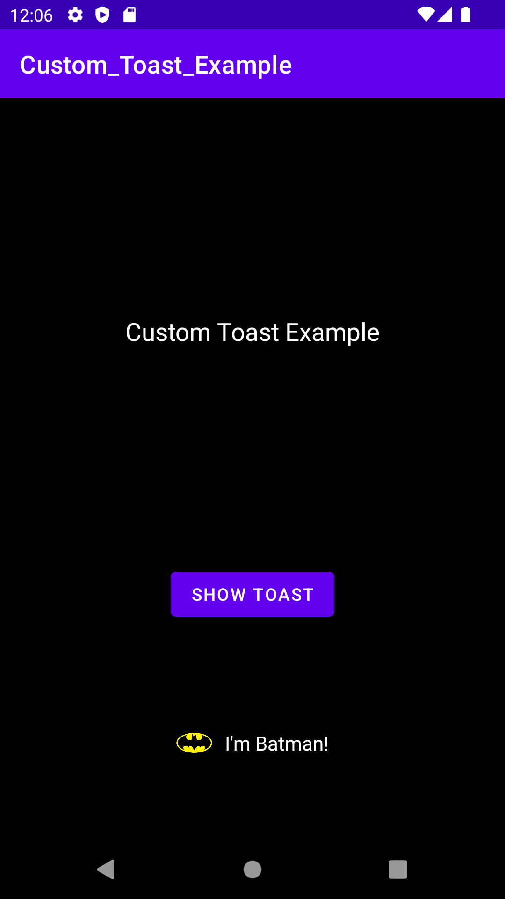

# Custom_Toast_Example
A Simple Custom Toast Example

Custom Toast Message Screenshot:

Note: "setView" method is deprecated in API level 30.
Custom toast views are deprecated. Apps can
create a standard text toast with "makeText" method,
or can use a Snackbar when in the foreground.
        
This was because some Apps can trick users by creating
custom Toasts on Top of other Apps for their Advantage
even if their App is on the Background. but if your App
if in the Foreground your custom Toast will still be
shown in all Android Versions.